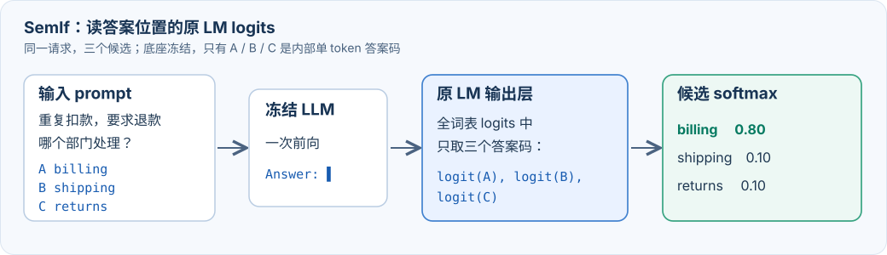
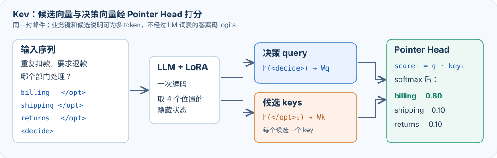

# Jev 风格决策模型：SemIf 与 Kev 的概率读出

资料核对：2026-09-28。本文讨论文本输入；TypeSafe [文档](https://docs.typesafe.ai/concepts/system-one)注明 Jev 当前尚未提供音频、图像或视频输入。官方产品说明、第三方 API 探测和开源仓库分别标明来源。

贯穿全文的例子是一封客户邮件：“同一笔订单被扣款两次，希望退款。”问题是“应由哪个部门处理？”，运行时候选为 `billing`、`shipping` 和 `returns`，每个候选还可以带一段说明。目标输出是一组相加为 1 的候选概率。

## 一、Jev 概念与官方效果

Jev 是 TypeSafe 发布的首个 System One 决策模型。[官方文档](https://docs.typesafe.ai/concepts/system-one)规定：输入共享 `state`、一个或多个问题及其合法候选，直接返回 `choice`、`noul`（是/否）或 `score`（有序等级）的结构化概率。下面按答案如何产生、模型如何训练、概率如何校准三条线看官方效果与公开复现。

### 1. 答案生成：直接读取候选分布

通常的 LLM 分类把邮件、问题和候选写进 prompt，再逐 token 生成 `{"department": "billing"}`。约束解码能保证格式，但单次生成只给出一个标签；若要完整分布，还需读取答案 token 的 logprobs 或逐候选评分。Jev 的接口一次返回每个合法候选的概率，且可在同一请求中回答多个问题。[TypeSafe 发布文章](https://typesafe.ai/blog/introducing-system-one-models-and-jev)报告端到端延迟约 **70–500 ms**，在所展示任务中速度约快 **40–200 倍**；其中短状态的 side-by-side 演示对 Jev 有利。

[Archer Hume 的 API 探测](https://archerhume.com/posts/jevs-architecture-unmasked)观察到：问题之间在行为上隔离、都能读取共享 `state`；增加无关候选也会改变原候选间的相对概率。这支持“共享状态—问题分支—候选读出”的重建方向，但未确定内部 attention、固定槽位还是 pointer head。对应的公开路线包括 [SemIf](https://github.com/TheoLeeCJ/SemIf) 与 [Nimble](https://github.com/bespokelabsai/nimble) 的答案 token logits、[Kev](https://github.com/jaredpalmer/kev) 的候选向量 pointer，以及 [NanoJev](https://github.com/TianyuCodings/NanoJev) 的候选集合交互；它们均不能被认定为官方 Jev 架构。

### 2. 模型训练：学习决策能力

[TypeSafe 的 RLCD 说明](https://docs.typesafe.ai/introduction/machine-learning-primer)将 **Reinforcement Learning for Calibrated Decisions** 用于同时提升决策质量和概率质量：模型既要选对，也要让“报 80% 的判断”在同类样本中大约八成正确，以便设置自动处理阈值。官方公布的整体效果是：在其展示的 System One 任务上，Jev 达到与前沿 LLM 相近的能力。[多问题工作流评测](https://typesafe.ai/blog/introducing-system-one-models-and-jev)以 GPT-6 Astra 与 Fable 5.1 的平均预测为参考，衡量与参考分布的一致程度；这不是对真实结果频率的校准检验，也不能把结果单独归因于 RLCD。官方没有公开足以复现的奖励函数、数据配比和优化细节。


*图源：[TypeSafe 发布文章的 Workflow evals](https://typesafe.ai/blog/introducing-system-one-models-and-jev)；这里关注任务表现与速度。*

开源训练可按读出和优化方式看：[Decider](https://github.com/Mapika/decider)等在受限答案 token logits 上做 SFT 或蒸馏；同类读出的 [Nimble](https://github.com/bespokelabsai/nimble/blob/main/README.md#finetuning)用合成的事实翻转样本和硬标签交叉熵训练 Qwen3.5-9B LoRA，明确没有从 Jev 蒸馏。[Kev](https://github.com/jaredpalmer/kev/blob/main/kev/train.py)用候选交叉熵联合训练底座 LoRA 与 Pointer Head。[Laya](https://github.com/NandhaKishorM/laya/blob/main/notebooks/laya_finetune_typed_decisions_2xT4_kaggle.ipynb)和 [NanoJev](https://github.com/TianyuCodings/NanoJev/blob/main/docs/RLCD_EXPERIMENT.md)公开了 RLCD 风格实验，可供比较采样奖励与直接可微损失，均非官方训练配方。

以 `billing` 为正确答案、候选依次为 `billing / shipping / returns` 为例：模型给出 `(0.8, 0.1, 0.1)` 时，正确候选的交叉熵损失 `−ln 0.8 ≈ 0.22`；若给出 `(0.1, 0.8, 0.1)`，损失升至 `−ln 0.1 ≈ 2.30`。Brier 损失将整组概率与正确答案向量 `(1, 0, 0)` 逐项比较、求平方和，上述两组分别为 `0.06` 和 `1.46`。两种损失面对**单条独热标签**时，最低点都在正确选项概率趋近 1；模型容量足够时，确实可能把训练样本学得过于肯定。

但“每条样本只有一个标签”不等于真实条件概率一定是独热的。若同类输入的真实结果有 70% 属于 `billing`、30% 属于 `shipping`，在足够多同分布样本上的交叉熵最优预测是 `(0.7, 0.3)`，不是 `(1, 0)`。有限数据、重复样本不足和分布变化会使实际模型过度自信；软标签、反事实样本与后校准各自处理其中一部分问题。训练损失会更新模型或分类头，可能改变候选排序；官方是否使用上述具体损失尚未公开。

### 3. 概率校准：让分数可用于阈值决策

后校准的边界先说清楚：对同一道题的所有候选施加同一个正温度 `T`，只改变概率分布的集中程度，**不改变候选排序，也不能修正选错的标签**。

对 Choice 而言，`P(billing | 邮件、问题、当前候选集)` 是一个候选的概率，整组 `P` 在候选内相加为 1。`confidence` 则是从这组概率**再算出的单个集中度指标**，不是对 `P` 再做一次 softmax。[TypeSafe 的开源适配器](https://github.com/typesafe-ai/system-one-adapter-python/blob/main/src/system_one_adapter/_utils/confidence_metrics.py)对 `K` 个 Choice 候选使用 `(最大候选概率 − 1/K) / (1 − 1/K)`：三选一概率为 `(0.8, 0.1, 0.1)` 时，最高的 `P` 是 `0.8`，`confidence` 是 `0.7`；均匀分布时为 0。Score 的 `confidence` 则按概率离最可能等级的距离计算；Noul 直接给“是”的概率。它们都不额外估计“本次一定答对”。

[官方 primer](https://docs.typesafe.ai/introduction/machine-learning-primer)对校准的定义是：大量被赋予 0.8 概率的事件，约有 80% 实际发生。若正确选项缺席，候选内 softmax 仍会给剩余选项分配总计 1 的概率，`confidence` 也可能很高。

公开的外部检验已经有一些，但只支持**在被测题目上的概率质量**。[JevBench v1.4 方法](https://github.com/fstandhartinger/jevbench/blob/main/docs/METHOD-v1.4.md)将校准列为独立评分轴；[v1.4.2 结果](https://benchmarkheaven.com/api/jevbench/v1.4.2)给 Jev 1.13.0 的 `Calibration` **76.34**，这是 0–100 轴分，绝非“76.34% 的概率可信”。[Malkuth 的公开对照](https://github.com/newfull5/malkuth/blob/main/docs/model-cards/malkuth-4b.md#evaluation)在其留出题上报告 Jev API 的多分类 Brier 为 **0.355**，低于同场测得的 Malkuth-4B **0.385**（越低越好）。[Kev 的新来源评测](https://github.com/jaredpalmer/kev#what-to-expect)也记录到 Jev 有 **3.7%** 的题目以至少 0.9 的概率答错。这些评测并未证明 Jev 在任意新业务、任意阈值下都校准；尤其缺少覆盖真实业务结果的普适性验证。

开源项目多在独立标注集上拟合温度，具体分组方法见第二部分第 4 节。真实答对率、领域迁移和自动执行阈值仍需用业务结果检验。

## 二、开源概率读出方案

### 1. SemIf：Zero-Shot 读取答案 token logits



*图 1｜SemIf：从原 LM 输出层只取候选答案码的 logits。图中数字仅作流程示意。*

[SemIf](https://github.com/TheoLeeCJ/SemIf/blob/master/docs/METHOD.md)的 **Zero-Shot** 版本直接使用现成底座推理，不为这项任务更新模型参数。它把每个业务候选映射到一个经 tokenizer 验证的答案标记。候选说明保留在 prompt 中，可以是多 token；模型只需在答案位置给 `A`、`B`、`C` 这些单 token 打分。

```text
state:  同一笔订单被扣款两次，希望退款。
question: 应由哪个部门处理？
A. billing  — 付款、扣款、退款
B. shipping — 配送、丢件
C. returns  — 退换货
Answer:

一次 prefill → 读取 logits[A], logits[B], logits[C] → softmax
```

这里不需要展开 LM 输出矩阵，真正执行的读出只有一行：

$$
\mathbf{p} = \operatorname{softmax}([\operatorname{logit}(A),\operatorname{logit}(B),\operatorname{logit}(C)])
$$

`p` 的三个位置依次映射回 `billing / shipping / returns`。只比较这三个答案码，不让模型生成答案；后校准时才在 softmax 前统一除以温度 `T`。[Decider 的 `slot_logits`](https://github.com/Mapika/decider/blob/main/decider/model.py#L18-L27)展示了相同的读取位置与 `lm_head` 筛选方式。

与让同一个 LLM 生成分类 JSON 相比，这个读出有四个直接收益：

1. **单次前向得到完整分布**。程序同时拿到所有合法候选的分数；无需让模型继续生成概率文字或反复采样。
2. **输出严格落在候选集合内**。程序从受限分布选标签并映射回业务键，省去自由生成标签时的拼写、别名和解析问题。
3. **候选说明可自由扩展**。`billing` 的描述可以是长文本；单 token 约束仅施加在内部答案标记上。
4. **复用已有模型与输出层**。冻结模型即可实验；服务端只需开放目标位置的 logits，推理中没有新训练的 Head。

收益有明确边界。若 LLM 本来就被约束为只输出一个答案字母，且推理服务同时提供所有字母的 logprobs，它执行的已是同类读出；SemIf 的关键是把这一读出固定成决策接口。概率仍依赖底座、prompt、候选内容和顺序。只在当前候选集上归一化也不会发现漏掉的正确选项。[SemIf 的校准分析](https://github.com/TheoLeeCJ/SemIf/blob/master/docs/CALIBRATION.md)讨论了温度缩放；候选顺序置换可用于检测字母位置偏好。

#### 同类工作：同一读出，三种训练目标

**[Decider 4B v2](https://github.com/Mapika/decider)：先做通用覆盖，再补难题。** 第一阶段在公开分类集、教师标注及可验证的程序生成题上做监督训练，让一个模型接多种决策格式；第二阶段用 LoRA 补政策规则、长文档等难题。其具体防遗忘手段是回放第一阶段数据；教师写的文档题需两次独立作答一致才收入训练。

**[JevK5](https://github.com/allebee/jevk5/blob/main/README.md#how-it-was-made)：把训练重心直接放在困难决策。** 教师生成含政策例外、日期数字陷阱、多步查找等问题的文档，并独立回答两次；答案一致才保留。用答案码交叉熵训练 LoRA，同时混入公开训练集回放，避免只会解教师题；少数有精确目标分布的题用软标签。

**[Nimble](https://github.com/bespokelabsai/nimble/blob/main/README.md#finetuning)：专练“关键证据变了，答案就要变”。** 同一道判断写成一对样本，只改动决定性的事实，标签随之翻转；标签由规则生成，不用 Jev 概率蒸馏。它只在答案码 logits 上用硬标签交叉熵训练 LoRA，并按来源家族拆分训练/测试，避免同一对反事实题泄漏到两边。

三者分别瞄准**任务广度、难题推理、证据敏感性**；读取概率的位置没有变。[JevBench v1.4.2](https://benchmarkheaven.com/api/jevbench/v1.4.2) 曾测试这些代表项目：Decider 4B v2、JevK5 v0.2、SemIf、Nimble 原始版的综合名次依次是第 1、3、11、60。该榜还计入成本，名次仅作外部实测背景。

### 2. Kev：从候选隐藏状态读取概率



*图 2｜Kev：`<decide>` 给一个 query，各 `</opt>` 给候选 key；点积后再归一化。图中数字仅作流程示意。*

[Kev 的编码](https://github.com/jaredpalmer/kev/blob/main/kev/model.py#L82-L118)把共享状态、问题与每个候选文本放进模型输入。候选结束标记 `</opt>` 的隐藏状态形成该候选的上下文化表示；问题末尾 `<decide>` 的隐藏状态汇总决策上下文。[PointerHead](https://github.com/jaredpalmer/kev/blob/main/kev/model.py#L182-L195)通过两个可训练投影计算每个候选的分数：

```text
<state> 同一订单扣款两次，希望退款
<q> 应由哪个部门处理？
<opt> billing：付款、扣款、退款 </opt>   → 候选向量 1
<opt> shipping：配送、丢件 </opt>       → 候选向量 2
<opt> returns：退换货 </opt>          → 候选向量 3
<decide>                               → 决策向量
```

```text
query = Wq · h(<decide>)
key_i = Wk · h(</opt>_i)
logit_i = key_i · query / √d
P(option_i) = softmax(logits/T)_i
```

`<decide>` 是唯一 query，`</opt>` 位置给出每个候选的 key；候选描述可以是多 token，业务键无需限定为 `0–9`。SemIf 从 LM 词表读答案码分数，Kev 从这些候选向量与决策向量的点积读分数。Kev 用正确候选的交叉熵同时训练底座 LoRA 和 Pointer Head，再在独立数据上[拟合温度](https://github.com/jaredpalmer/kev/blob/main/scripts/calibrate_checkpoint.py)；仅在 vLLM 中动态加载 LoRA 不能执行这个独立 Head。Kev 对多个问题的隔离处理与前述 API 探测的推断相近，但不证明官方 Jev 使用了同一结构。

#### 同类工作：一个扩语言，一个换底座

**[Kev](https://github.com/jaredpalmer/kev)** 本身用公开分类集、合成政策题和规则组合题训练底座 LoRA 与 Pointer Head；后续增加缺失关键证据和真实文档样本，目标是让同一读出头覆盖更多业务决策。

**[Malkuth-4B](https://github.com/newfull5/malkuth/blob/main/docs/model-cards/malkuth-4b.md)：扩到多语言。** 从 Kev 检查点继续训练，保留 Pointer Head；训练集换成 20 个公开来源的多语言标注，重点补韩语。它验证的是同一结构的语言迁移，而非新的取概率方式。

**[Lev-350M](https://github.com/franckverrot/lev#what-changed-from-kev)：换到有卷积层的小底座。** 复用 Kev 的训练与评测框架，但 LFM2.5-350M 的短卷积会跨问题传信息，仅靠 Kev 的 attention mask 不够；Lev 为卷积层设置每个问题自己的前驱链，保持问题隔离。这是移植 Pointer Head 时必须处理的结构差异。

[JevBench v1.4.2](https://benchmarkheaven.com/api/jevbench/v1.4.2) 测试过这些代表项目：Malkuth-4B 第 16、Kev 4B 预览版第 28、Lev-350M 第 44。名次对应榜单中的具体版本，且综合分包含成本。

### 3. 其他实现路径

| 路径 | 候选分数的来源 | 公开项目 |
|---|---|---|
| 候选集合交互 | 各候选路径编码后经 set attention 交换信息，再由共享 Head 打分 | [NanoJev](https://github.com/TianyuCodings/NanoJev)；当前 JevBench 数据未收录其模型 |
| 候选 marker / span | 编码器中每个候选前的 `[MASK]` 向量，或候选文本 span 的池化向量 | [Laya](https://huggingface.co/convaiinnovations/laya)、[Von](https://github.com/wfzyx/von/blob/master/src/von/models/option_marker.py)、[smalljev](https://github.com/isHeSatoshi/smalljev) |
| 独立候选 scalar Head | 每个 `state + question + candidate` 序列独立编码，由共享标量 Head 打分 | [Zefan Open-Jev](https://github.com/Zefan-Cai/Open-Jev) |
| Reranker / embedding | 每候选 cross-encoder 分数，或状态与候选向量的相似度 | [SemIf rerank](https://github.com/TheoLeeCJ/SemIf/blob/master/docs/METHOD.md)、[CLM](https://github.com/Contrastive-LM/CLM) |
| 扩散模型读出 | DiffusionGemma 的去噪状态或结构化画布 | [djev](https://github.com/Davipar/djev-dev)、[OpenJev DiffusionGemma](https://github.com/razorback16/openjev) |

这些方法都可以包装成“输入候选、输出概率”的 API，计算路径与训练数据却不同。Reranker 的相关性分数尤其需要针对候选决策任务重新校准。

### 4. 概率后校准：按什么范围拟合温度

模型训练完成后，固定参数，在与训练集分开的标注数据上选择正温度 `T`，将每题的候选 logits 统一除以 `T` 再做 softmax。`T > 1` 让概率更平，`0 < T < 1` 让概率更尖；同题候选的第一名始终不变。公开项目主要区别在于：哪些题共用一个温度。

**全局单温度。** [Kev](https://github.com/jaredpalmer/kev/blob/main/scripts/calibrate_checkpoint.py)为每个检查点拟合一个温度，[JevK5](https://github.com/allebee/jevk5/blob/main/README.md#how-it-was-made)的发布版和 [Nimble 原始版](https://github.com/bespokelabsai/nimble/blob/main/README.md#probability-temperature)也采用单温度。所有题按同一刻度调整，所需校准样本相对少。

**按业务场景或数据域拟合。** [SemIf](https://github.com/TheoLeeCJ/SemIf/blob/master/docs/CALIBRATION.md)在不同 workload 上分别用标注集最小化负对数似然，得到各自的温度。不同业务若有明显不同的过度自信程度，可分开调整。

**按题型或候选数分组。** [Decider](https://github.com/Mapika/decider/blob/main/decider/temperature.py)支持按 `choice / noul / score` 类型和 prompt 布局拟合；[Laya](https://github.com/NandhaKishorM/laya/blob/main/research/README.md)实验按题型与候选数量分组。每组仍对同一道题使用同一个正温度。分组越细，越需要足够的独立标注样本，以免只贴合校准集。

温度可在校准集上以负对数似然选择，再用留出的测试集检查 Brier、校准误差与高置信错误。训练集、校准集和测试集应按案例或来源隔离；温度不能补回缺失候选，也不能解决新的业务领域中的系统性误判。

## 三、业务落地
